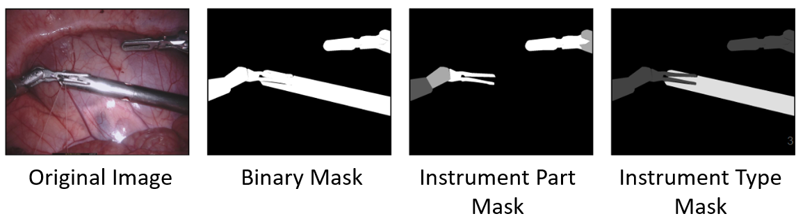
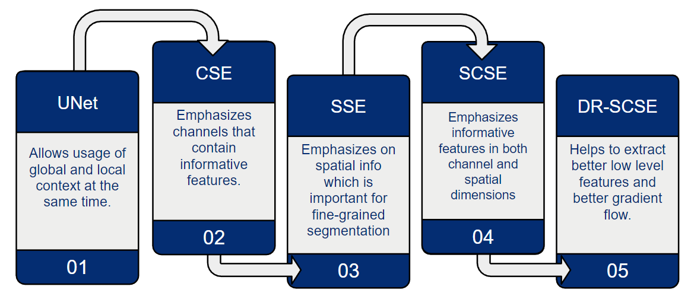
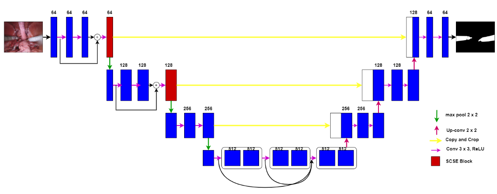
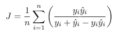
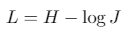

===========================================
MICCAI 2017 Robotic Instrument Segmentation
===========================================

Base Code taken from: https://github.com/ternaus/robot-surgery-segmentation, https://github.com/ai-med/squeeze_and_excitation

New Additons: Extended base U-Net architecture with Spatial Squeeze and Channel Excitations, Channel Squeeze and Spatial Excitation, Concurrent Spatial and Channel Squeeze and Channel Excitation blocks. 

Data
----
The training dataset consists of 8 x 225-frame sequences of high resolution stereo camera images acquired from a da Vinci Xi surgical system during several different porcine procedures. Every video sequence consists of two stereo channels taken from left and right cameras and has a 1920 x 1080 pixel resolution in RGB format. The articulated parts of the robotic surgical instruments, such as a rigid shaft, an articulated wrist and claspers have been hand labelled in each frame. Furthermore, there are instrument type labels that categorize instruments in following categories: left/right prograsp forceps, monopolar curved scissors, large needle driver, and a miscellaneous category for any other surgical instruments.

* Images are cropped from (320, 28) to extract 1280 x 1024 dimension camera images.

* Three Sub Challenges: Binary Instrument Segmentation, Instrument Part Segmentation, Instrument Type Segmentation.

* Based on the mappings, we generate ground truth masks to train the model. 

Method
------
We evaluate 4 different deep architectures for segmentation: We use `U-Net`_, as our base model. We extend U-net with patial Squeeze and Channel Excitations, Channel Squeeze and Spatial Excitation, Concurrent Spatial and Channel Squeeze and Channel Excitation blocks. 

Model architecture
------------------

Training
--------

We use Jaccard index (Intersection Over Union) as the evaluation metric. It can be interpreted as a similarity measure between a finite number of sets. For two sets A and B, it can be defined as following:

.. raw:: html

    <figure>
        
    </figure>

Since an image consists of pixels, the expression can be adapted for discrete objects in the following way:

where |y| and |y_hat| are a binary value (label) and a predicted probability for the pixel |i|, respectively.

Since image segmentation task can also be considered as a pixel classification problem, we additionally use common classification loss functions, denoted as H. For a binary segmentation problem H is a binary cross entropy, while for a multi-class segmentation problem H is a categorical cross entropy.

As an output of a model, we obtain an image, where every pixel value corresponds to a probability of belonging to the area of interest or a class. The size of the output image matches the input image size. For binary segmentation, we use 0.3 as a threshold value (chosen using validation dataset) to binarize pixel probabilities. All pixel values below the specified threshold are set to 0, while all values above the threshold are set to 255 to produce final prediction mask. For multi-class segmentation we use similar procedure, but we assign different integer numbers for each class.

Dependencies
------------

* Python 3.6
* PyTorch 0.4.0
* TorchVision 0.2.1
* numpy 1.14.0
* opencv-python 3.3.0.10
* tqdm 4.19.4

To install all these dependencies you can run
::
    pip install -r requirements.txt

How to run
----------

The dataset is organized in the folloing way:

::

    ├── data
    │   ├── cropped_train
    │   ├── models
    │   ├── test
    │   │   ├── instrument_dataset_1
    │   │   │   ├── left_frames
    │   │   │   └── right_frames
    |   |   ....................... 
    │   └── train
    │       ├── instrument_dataset_1
    │       │   ├── ground_truth
    │       │   │   ├── Left_Prograsp_Forceps_labels
    │       │   │   ├── Maryland_Bipolar_Forceps_labels
    │       │   │   ├── Other_labels
    │       │   │   └── Right_Prograsp_Forceps_labels
    │       │   ├── left_frames
    │       │   └── right_frames
    │       .......................

The training dataset contains only 8 videos with 255 frames each. Inside each video all frames are correlated, so, for 4-fold cross validation of our experiments, we split data using this dependance i.e utilize whole video for the validation. In such a case, we try to make every fold to contain more or less equal number of instruments. The test dataset consists of 8x75-frame sequences containing footage sampled immediately after each training sequence and 2 full 300-frame sequences, sampled at the same rate as the training set. Under the terms of the challenge, participants should exclude the corresponding training set when evaluating on one of the 75-frame sequences. 

1. Preprocessing
~~~~~~~~~~~~~~~~~~~~~~
As a preprocessing step we cropped black unindormative border from all frames with a file ``prepare_data.py`` that creates folder ``data/cropped_train.py`` with masks and images of the smaller size that are used for training. Then, to split the dataset for 4-fold cross-validation one can use the file: ``prepare_train_val``.

2. Training
~~~~~~~~~~~~~~~~~~~~~~
The main file that is used to train all models -  ``train.py``.

Running ``python train.py --help`` will return set of all possible input parameters.

To train all models we used the folloing bash script :

::

    #!/bin/bash

    for i in 0 1 2 3
    do
       python train.py --device-ids 0,1,2,3 --batch-size 16 --fold $i --workers 12 --lr 0.0001 --n-epochs 10 --type binary --jaccard-weight 1 --model UNetCSE
    done

3. Mask generation
~~~~~~~~~~~~~~~~~~~~~~
The main file to generate masks is ``generate_masks.py``.

Running ``python generate_masks.py --help`` will return set of all possible input parameters.

Example:
:: 
    python generate_masks.py --output_path predictions/unet/binary --model_type UNet --problem_type binary --model_path runs/debug/unet/binary --fold -1 --batch-size 4

4. Evaluation
~~~~~~~~~~~~~~~~~~~~~~
The evaluation is different for a binary and multi-class segmentation: 

[a] In the case of binary segmentation it calculates jaccard (dice) per image / per video and then the predictions are avaraged. 

[b] In the case of multi-class segmentation it calculates jaccard (dice) for every class independently then avaraged them for each image and then for every video
::

    python evaluate.py --target_path predictions/unet --problem_type binary --train_path data/cropped_train

Results
------------
Original Mask
.. raw:: html

    <figure>
        
    </figure>

UNet Mask
.. raw:: html

    <figure>
        
    </figure>
CSE Mask
.. raw:: html

    <figure>
        
    </figure>
SSE Mask
.. raw:: html

    <figure>
        
    </figure>
SCSE Mask
.. raw:: html

    <figure>
        
    </figure>
DR-SCSE Mask
.. raw:: html

    <figure>
        
    </figure>

